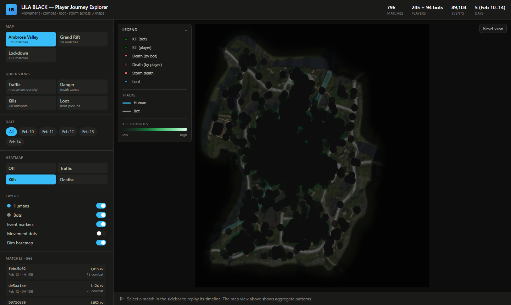

# LILA BLACK — Player Journey Explorer

A web tool for the Level Design team to *see* how players move, fight, loot, and die across
LILA BLACK's three maps — built from 5 days of production telemetry (89,104 events, 796 matches,
339 players).

**▶ Live demo: https://lila-journey-tool.vercel.app**



## What it does
- **Journeys on the correct minimap** — world `(x,z)` mapped to each map's minimap via the README's
  UV transform, verified against the worked example.
- **Humans vs bots**, visually distinct — cyan tracks for humans, gray for bots (numeric-id = bot).
- **Every event type as a distinct marker** — Kill / Death / Storm-death / Loot, encoded by **color
  family + icon shape** (accessible, CVD-validated) with a live legend.
- **Filter by map, date, and match** (plus per-player drill-down inside a match).
- **Timeline playback** — replay a match unfolding over time with a scrubber, play/pause, and 0.5–4×
  speed (time-scaled because raw match records are sub-second bursts).
- **Heatmaps** — Traffic (movement density), Kill zones, and Death/danger zones.
- **Shareable URLs** — the current map/date/match/heatmap is encoded in the URL; copy the link to
  share an exact view.
- Hover tooltips, live world-coordinate read-out, dimmable basemap, reset view.

## Tech stack
- **Preprocessing:** Node + [`hyparquet`](https://github.com/hyparam/hyparquet) (Parquet) + `sharp` (image optimisation)
- **Frontend:** React + Vite + TypeScript, **deck.gl** (WebGL rendering), Zustand (state), Tailwind CSS
- **Hosting:** Vercel (static build)

See **[ARCHITECTURE.md](./ARCHITECTURE.md)** for the design rationale and the coordinate-mapping walkthrough,
and **[INSIGHTS.md](./INSIGHTS.md)** for three evidence-backed findings.

## Getting started
```bash
npm install

# 1) Turn the raw Parquet into web-ready static artifacts + optimised minimaps
#    (reads from the DATA_DIR set at the top of scripts/preprocess.mjs)
npm run preprocess

# 2) Run the app
npm run dev            # http://localhost:5173
```
Build & preview the production bundle:
```bash
npm run build          # -> dist/
npm run preview
```
There are **no environment variables** to configure.

### Regenerating the data
The preprocessed artifacts in `public/data/` and `public/minimaps/` are committed so the app builds and
deploys without the raw dataset. To regenerate them, point `DATA_DIR` at the top of
`scripts/preprocess.mjs` to your `player_data/` folder and run `npm run preprocess`.

## Project structure
```
scripts/preprocess.mjs     Parquet -> manifest/maps/matches/analysis JSON + optimised minimaps
public/data/               manifest.json, maps/<map>.json, matches/<id>.json, analysis.json
public/minimaps/           <map>.webp (downscaled basemaps)
src/
  lib/       types, coords (mirror of pipeline math), colors (validated), data (fetch+cache), url, iconAtlas
  store.ts   Zustand: filters, layers, heatmap, playback
  components/ MapCanvas (deck.gl), Sidebar, Timeline, Legend, TopBar
```

## Deployment
Static output in `dist/` deploys to any static host. For Vercel:
```bash
npm run build
npx vercel --prod      # framework: Vite, build: `npm run build`, output: dist
```
`base: './'` in `vite.config.ts` keeps asset paths relative, so it also works on GitHub Pages or any subpath.

---
Data: LILA BLACK production telemetry (Feb 10–14, 2026). Built as a Product Engineer take-home.
